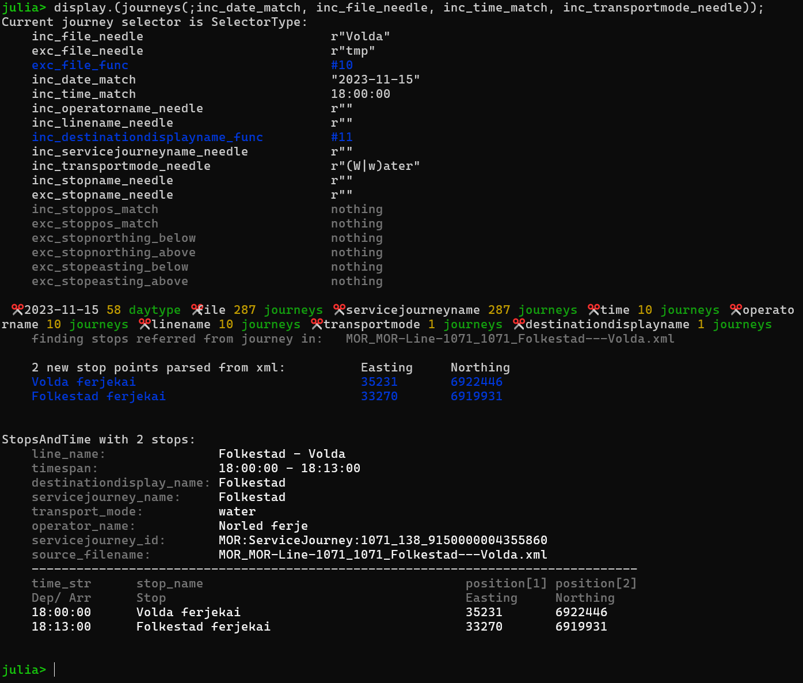

# StopsAndTimetables.jl
Download public transport data from https://developer.entur.org/stops-and-timetable-data. 

Call `journey(keywords..)` to filter and structure to a `Vector{StopsAndTime}`.

## Usage
Download .xml files. 

Install and call `journeys()` (#Example)[#Example]. An .ini file is generated when you first call `journeys()`. You can adapt it to your location by editing. 

Move the downloaded .xml files to the file locations (re)defined in the .ini file.

Stopplace / destination lookups are potentially slow, especially for out-of-county journeys. After xml data is parsed once in a session, they are quicker. Do take
care to reduce the amount of data by filtering early in the pipeline! Feedback from the pipeline is printed to stdout. For searches in other counties,
adapting the .ini file order definitions is advised but not necessary.

The `journey` function uses default filters and selectors. You override such filters
by keyword arguments, e.g.: `journey(; inc_file_needle = "Ekspress")`. For example, there
is a default date selection. Override it with `inc_date_match = ""` to get results for all dates.

The return type is a vector of `StopsAndTime`. Geographical coordinates are given in UTM33 (easting, northing) coordinates, where one unit is very close to 1 meter.

## Example

```
(@v1.9) pkg> registry add https://github.com/hustf/M8

(@v1.9) pkg> add StopsAndTimeTables

julia> using StopsAndTimetables, Dates

julia> begin
        inc_date_match = "2023-10-01"
        inc_time_match = Time("18:00")
        inc_file_needle = "Volda"
        inc_transportmode_needle = "water"
    end;

julia> # The following takes ~5 seconds the first time.

julia> display.(journeys(;inc_date_match, inc_file_needle, inc_time_match, inc_transportmode_needle));

```


## Before you go...

We have implemented a way of going from a date to a StopsAndTime, but not the other way around.

Manually inspecting xml files is easy on a case by case basis, though. Generally followed rules are harder to find. Lacking .xsd-files, we made this little tool for inspecting the structure of .xml docs: [resources/explore_timetable.jl](resources/explore_xml.jl).

For inspection, we suggest using the xpath syntax. A starting point from /src:

```
function ServiceJourney(daytype_string; kw...)
    rs = roots(;kw...)
    xp = """//x:ServiceJourney/x:dayTypes/x:DayTypeRef[@ref = \"$daytype_string\"]/../.."""
    v = Vector{EzXML.Node}()
    for r in rs
        v_a = findall(xp, r, NS)
        if ! isempty(v_a)
            append!(v, v_a)
        end
    end
    v
end
```

Examples of traversing trees can be found in [EzXML.jl](https://github.com/JuliaIO/EzXML.jl).